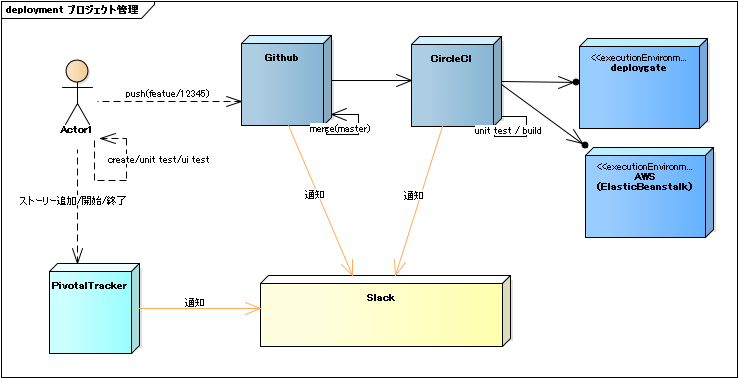

# 神Pedia Project( API )

## 必要なアカウント
- GitHub
- Slack ( 情報集約 )
- [Pivotal Tracker]( https://www.pivotaltracker.com/n/projects/1989469  ) ( プロジェクト管理 ) 
- CircleCI ( CI環境 )
- AWS ElasticBeanstalk 
- [Swagger](http://kamipedia-sample-dev.ap-northeast-1.elasticbeanstalk.com:8080/swagger-ui.html#!) ( ( API ドキュメント ) )

## 運用ルール
1. GitのcommitコメントにpivotalのストーリーIDを含める
`[#12345677 #12345678] Diverting power from warp drive to torpedoes.`
2. 必ずmasterからブランチを切って、PullRequestを投げる ( できるだけレビューを受ける )

## 受入テスト(RobotFramework)

